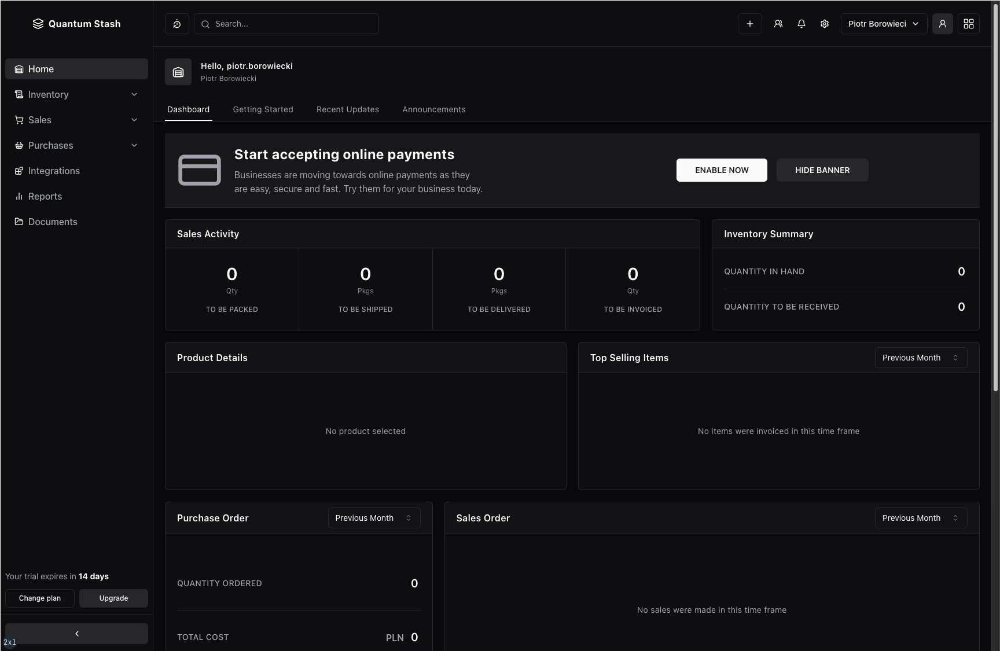
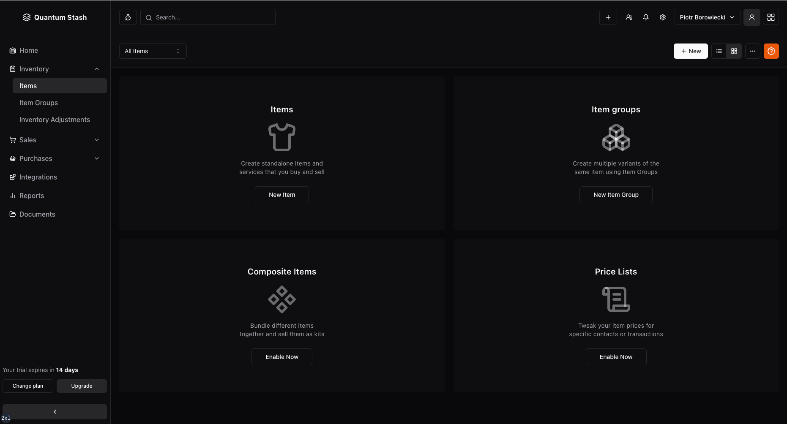

# Quantum Stash

**WORK IN PROGRESS**

Quantum Stash is an open-source Software as a Service (SaaS) web application designed for efficient inventory management.

Tailored for e-commerce companies, it is versatile enough to meet the needs of any business requiring meticulous stock control. Explore the power of Quantum Stash to streamline your operations, providing a comprehensive solution for overseeing your stock and optimizing business processes.

The project serves as my portfolio demo piece, showcasing my skills in developing full-stack applications involving advanced features and techniques, such as:

- Modern, intuitive user interface
- Appropriate server- and client-side rendering
- Advanced authentication, including:
  - JWT and HTTP-Only Cookies
  - Authentication with OAuth Google and GitHub providers
  - Authentication with email and password
  - Email verification functionality
  - Password reset and update functionality
- Transactional emails with Resend and React Email
- Serverless PostgreSQL database conenction
- Complex ralations between database models
- Prepared statements for fast SQL execution
- Client- and server-side form validation with Zod
- Server actions
- Relevant CRUD operations
- Stripe payments integration
- Robust type checking and full type safety

You can check the deployed demo version [TODO: here]()

 

 

## Tech Stack

- **Framework:** [Next.js 14](https://nextjs.org)
- **Authentication:** [Next-Auth 5](https://next-auth.js.org/)
- **Database:** [Postgres (Neon)](https://neon.tech/)
- **ORM:** [Drizzle ORM](https://orm.drizzle.team)
- **Forms:** [React Hook Form](https://react-hook-form.com)
- **Email:** [React Email](https://react.email) and [Resend](https://resend.com)
- **Validations:** [Zod](https://zod.dev/)
- **Styling:** [Tailwind CSS](https://tailwindcss.com)
- **UI Components:** [shadcn/ui](https://ui.shadcn.com)
- **Hosting:** [Vercel](https://vercel.com)

 

## ToDo

- [ ] User interface (UI)
- [ ] Implement authentication and authorization
- [ ] Use new SignIn and SignOut methods in place of the ones from v. 4
- [ ] Fix the avatar after OAuth SignIn not being visible
- [ ] Fix the toast messaging after correct Sign In
- [ ] Unable or gracefully handle sign in with the same email, using Google and GitHub (OAuthAccountNotLinkedError)
- [ ] Refactor server actions
- [ ] Set up database connection and ORM
- [ ] Define data schemas
- [ ] Implement missing forms
- [ ] Implement User, Organizations, Notifications, and Quick Help menu pages
- [ ] Implement Other Apps menu
- [ ] Connect Stripe and define plans
- [ ] Make SaaS subscriptions functional
- [ ] Make the dashboard use dynamic data
- [ ] Set up and implement email notifications
- [ ] User profile management
- [ ] Database connection with Neon's PostgreSQL and DrizzleORM
- [ ] Transactional emails with Resend and React Email
- [ ] Collapse any open collapsibles in the sidebar nav when collapsing the sidebar itself (use global state management)
- [ ] Improve responsiveness
- [ ] Fix the QuickCreate menu
- [ ] Fix the gaps in Settings
- [ ] Add skeleton loading states for all pages
- [ ] Extend prepared statements with create, update and delete
